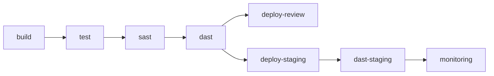

# Estudo de Caso: DevSecOps

Aplicação de conceitos **DevOps** e **DevSecOps** em um sistema de gerenciamento de tarefas pessoais desenvolvido com **Flask**, containerizado com **Docker**, com pipeline **CI/CD** completo, análise de segurança (**SAST/DAST**), e monitoramento com **Promtail + Loki + Grafana**.

## Badges

| Pipeline | Status |
| --- | --- |
| CI/CD (build + test + sast + dast + deploy) | [github.com/HDB-ATIVIDADES/Task-Manager-using-Flask/actions](https://github.com/HDB-ATIVIDADES/Task-Manager-using-Flask/actions) |

## Repositórios

- [github.com/HDB-ATIVIDADES/Task-Manager-using-Flask](https://github.com/HDB-ATIVIDADES/Task-Manager-using-Flask) — Código da aplicação, pipeline CI/CD e infraestrutura
- [github.com/HDB-ATIVIDADES/case-study](https://github.com/HDB-ATIVIDADES/case-study) — Documentação e relatório final

## Pull Requests Relevantes

| PR | Descrição |
| --- | --- |
| #5 | CI: testes automatizados + SAST (Bandit/pip-audit) |
| #6 | DAST: OWASP ZAP baseline scan |
| #7 | CD: GitFlow + review/staging/deploy |
| #10 | CI/CD + DAST: correções de paths e workdir |
| #11 | Monitoramento: Promtail + Loki + Grafana |
| #12 | Deploy multiplataforma: arm64 + amd64 |

## Etapas

| Etapa | Descrição | Documentação |
| --- | --- | --- |
| 1 | Planejamento e Requisitos | [`docs/etapa-1/`](docs/etapa-1/) |
| 2 | Containerização e Segurança | [`docs/etapa-2/`](docs/etapa-2/) |
| 3 | Testes e Pipeline CI | [`docs/etapa-3/`](docs/etapa-3/) |
| 4 | Análise Estática (SAST) | [`docs/etapa-4/`](docs/etapa-4/) |
| 5 | Análise Dinâmica (DAST) | [`docs/etapa-5/`](docs/etapa-5/) |
| 6 | Entrega Contínua (CD) | [`docs/etapa-6/`](docs/etapa-6/) |
| 7 | Monitoramento | [`docs/etapa-7/`](docs/etapa-7/) |
| 8 | Relatório Final | [`docs/relatorio-final.md`](docs/relatorio-final.md) |

## Pipeline CI/CD (8 jobs)

- **build:** Checkout + Python 3.9 + cache pip + validação
- **test:** 43 testes com pytest + relatório JUnit
- **sast:** Bandit (falha apenas em HIGH) + pip-audit (report)
- **dast:** OWASP ZAP baseline scan
- **deploy-review:** Smoke test + comentário no PR
- **deploy-staging:** Deploy com aprovação manual
- **dast-staging:** ZAP scan pós-deploy
- **monitoring:** Geração de tráfego + verificação Loki + export dashboard

## Stack Tecnológica

| Categoria | Ferramentas |
| --- | --- |
| App | Python 3.9, Flask 1.1.4, SQLAlchemy, Flask-Bcrypt |
| Container | Docker, Docker Compose |
| Testes | pytest (43 testes) |
| SAST | Bandit, pip-audit |
| DAST | OWASP ZAP |
| CI/CD | GitHub Actions (GitFlow) |
| Monitoramento | Promtail, Loki, Grafana |

## Site / GitHub Pages

Documentação completa disponível em: [https://HDB-ATIVIDADES.github.io/case-study/](https://HDB-ATIVIDADES.github.io/case-study/)

---

*Estudo de caso acadêmico — Programa Hackers do Bem*
