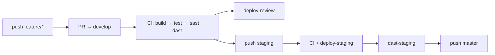
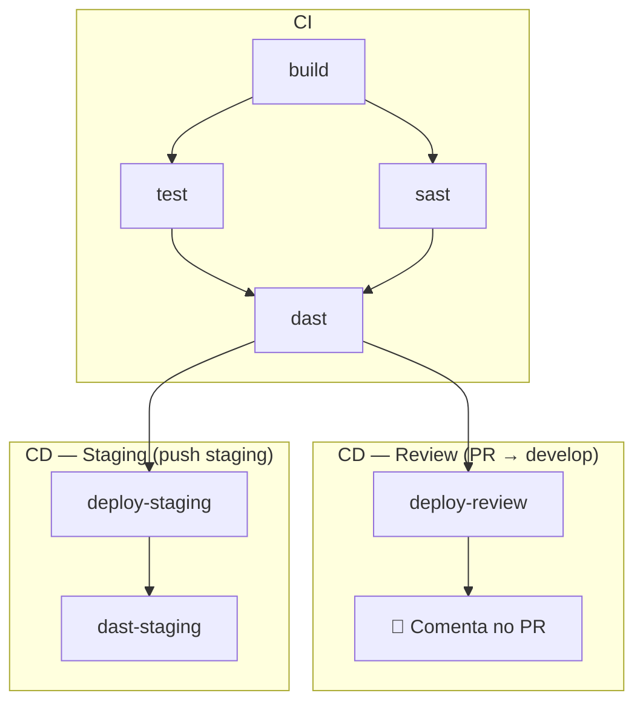
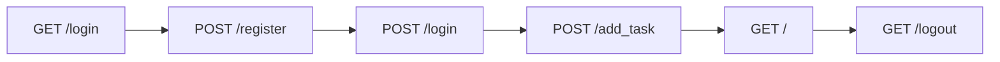

# Etapa 6: Entrega Contínua (CD)

## Branch Strategy (GitFlow)

```{mermaid}
gitGraph
  commit id: "início"
  branch develop
  checkout develop
  commit id: "base develop"
  branch feature/xyz
  commit id: "feature A"
  commit id: "feature B"
  checkout develop
  merge feature/xyz id: "PR merge"
  branch staging
  commit id: "candidato release"
  checkout master
  merge staging id: "deploy produção"
```

| Branch | Uso | Gatilho |
| -------- | ----- | --------- |
| `feature/*` | Desenvolvimento | Cria PR para `develop` |
| `develop` | Integração + testes | Push (`CI`) / PR (`CI + review`) |
| `staging` | Pré-produção com aprovação | Push (`CI + deploy + DAST`) |
| `master` | Produção | Push (`CI` apenas) |

## Fluxo de Eventos



## Pipeline Completo



## Jobs

### 1. `deploy-review` — Ambiente de Revisão

- **Trigger**: `pull_request` para `develop`
- **Depende**: `dast`
- **Environment**: `review`
- **Passos**:
  1. Sobe app com `docker compose up -d`
  2. Aguarda disponibilidade (loop curl, até 30s)
  3. Executa smoke tests (`scripts/smoke_test.py`)
  4. Comenta no PR com URL e credenciais

```yaml
deploy-review:
    if: github.event_name == 'pull_request' && github.base_ref == 'develop'
    environment:
      name: review
      url: http://localhost:5000
    steps:
      - run: docker compose up -d
      - run: python scripts/smoke_test.py http://localhost:5000
      - uses: actions/github-script@v7
        with:
          script: |
            github.rest.issues.createComment({
              issue_number: context.issue.number,
              body: '## ✅ Review Environment Ready\nURL: localhost:5000\nUsuário: reviewer / pass123'
            })
```

### 2. `deploy-staging` — Deploy em Stage

- **Trigger**: `push` para `staging`
- **Depende**: `dast`
- **Environment**: `staging` (**requer aprovação manual**)
- **Passos**:
  1. Sobe app com `docker compose -p staging up -d`
  2. Aguarda disponibilidade
  3. Executa smoke tests

### 3. `dast-staging` — DAST no Stage

- **Trigger**: `push` para `staging`
- **Depende**: `deploy-staging`
- **Passos**:
  1. Sobe app com `docker compose -p staging up -d`
  2. Executa ZAP Baseline Scan contra `http://app:5000`
  3. Gera relatório JSON + HTML
  4. Upload como artefato `zap-staging-report`

## Smoke Tests (`scripts/smoke_test.py`)

Script Python com `urllib` (sem dependências externas) que valida:



## Configuração do Environment `staging`

1. **Settings → Environments → New Environment**
2. **Nome**: `staging`
3. **Protection rules**: Required reviewers → seu usuário
4. **Deployment branches**: `staging`

## Diferenças CI vs CD

| Aspecto | CI | CD |
| --------- | ---- | ---- |
| Gatilho | Push qualquer branch / PR develop | PR develop ou push staging |
| Aprovação | Automática | Manual (staging) |
| Jobs | build, test, sast, dast | deploy-review, deploy-staging, dast-staging |
| Artefatos | test-report, bandit, pip-audit, zap | zap-staging-report |
| Propósito | Validar código | Validar deploy + segurança pós-deploy |

## Como testar localmente

```bash
python scripts/smoke_test.py http://localhost:5000
```
